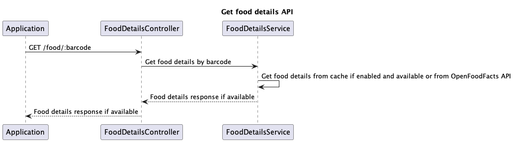
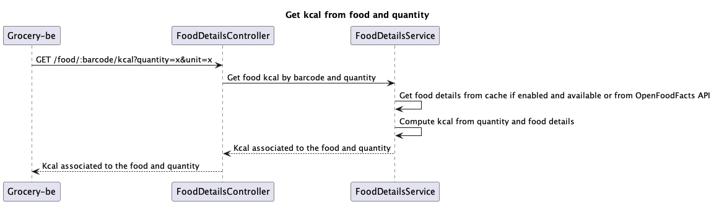

# Food-detail-integrator-be

## Description
This microservice has the simple goal of be a middleware between [openFoodFacts](https://world.openfoodfacts.org/) and 
other applications, in my case [grocery-be](https://github.com/nico-iaco/grocery-be), to retrieve additional food details 
from barcode and calculate the amount of kcal assumed from barcode and quantity, it has also the feature of caching which if 
enabled allow us to avoid useless api calls to OpenFoodFacts.

## Features

### Get food details
URL: `/food/:barcode`

Method: GET

Response
```json
{
    "generic_name": "",
    "image_url": "",
    "image_nutrition_url": "",
    "nutriments": {
        ...various field
    },
    "quantity": 0
}
```

This feature is used to retrieve additional information about food by barcode, into service class the application try to 
get them from redis cache if cache feature is enabled and, if the details were not in cache, try to obtain them from OpenFoodFacts 
sdk otherwise, if cache feature is disabled, it goes directly to OpenFoodFacts sdk.

### Get kcal from food and quantity

URL: `/food/:barcode/kcal`

Method: GET

Query parameter

| name     | type   | required |
|----------|--------|----------|
| quantity | float  | yes      |
| unit     | string | no       |

Response: float


This feature is used to calculate how much kcals there were in food for given quantity, into service class first it get 
food details from previous feature then it does this calculation: computedQuantity := (kcalFor100 / 100) * quantity where 
kcalFor100 is how many kcals are present for 100g of that food

## Requirements

- [Redis](https://redis.io/) (optional)

## Installation

### Cluster installation

To install this app in a cluster, first create grocery namespace, then modify the kustomization.yaml file in /k8s/overlays/qa
changing the property to match your configuration and run the following command:

```bash
kubectl apply -k k8s/overlays/qa
```

### Local installation

#### Docker

You can run this app locally with docker. To do so, run the following command:

```bash
docker run -p 8080:8080 ghcr.io/nico-iaco/food-detail-integrator-be:latest -e {ALL_ENV_VARIABLES}
```

#### With docker compose

You can also run this application with docker compose, use the template inside the root of this repository to run it.
Create a directory and inside it download the `docker-compose.yml` file in this repository:
```bash
mkdir food-details-integrator-be
cd food-details-integrator-be
wget 'https://raw.githubusercontent.com/nico-iaco/food-details-integrator-be/main/compose.yml'
```
After that you can run it using:
```bash
docker compose up
```

## Environment variables

| Name          | Description                                       | Default value |
|---------------|---------------------------------------------------|---------------|
| PORT          | Port on which the app will listen                 | 8080          |
| GIN_MODE      | Release type of app                               | debug         |
| REDIS_URL     | Redis host                                        |               |
| REDIS_ENABLED | Flag to enable redis cache                        | false         |
| IS_SANDBOX    | Flag for choosing open food facts api environment | false         |

